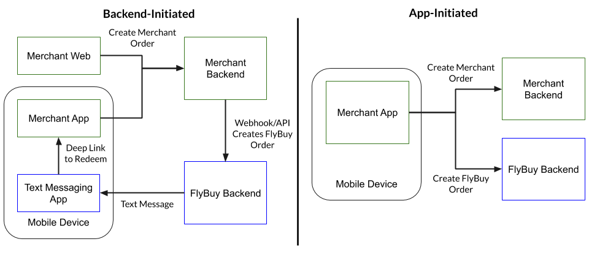

# SDK Integration

There are two main SDK integration methods for FlyBuy depending on the backend and client app:



The SDK integration steps needed for each method are:

* Backend-Initiated - FlyBuy order is created by webhook/API from merchant backend.
  * [Initialize SDK](#initialize-sdk)
  * [Location Permissions](#location-permissions)
  * [Deep linking](#deep-linking) using white label domain
  * [Order redemption flow](#order-redemption-flow)
  * [Order status screen](#order-status-screen)
  * [Customer Management](#customer-management)
  * [Order Management](#order-management)
  * [Push message handling](#push-message-handling)
* App-Initiated - Merchant app creates FlyBuy order using SDK.
  * [Initialize SDK](#initialize-sdk)
  * [Location Permissions](#location-permissions)
  * [Order creation flow](#order-creation-flow)
  * [Order status screen](#order-status-screen)
  * [Customer Management](#customer-management)
  * [Order Management](#order-management)
  * [Push message handling](#push-message-handling)

## Initialize SDK

The FlyBuy SDK must be initialized when the application starts in order to configure the app authorization token and handle appropriate lifecycle methods. Refer to the quick start guides for [iOS](https://github.com/RadiusNetworks/flybuy-ios/blob/master/doc/quickstart.md) and [Android](https://github.com/RadiusNetworks/flybuy-android/blob/master/doc/quickstart.md) for details on installing and initializing the SDK.

## Location Permissions

FlyBuy uses location services on the mobile devices to send updates and provide accurate ETAs to the merchant site. Prior to or during the [Order Redemption Flow](#order-redemption-flow) or [Order Creation Flow](#order-creation-flow), the app must ask for location permissions from the user. Refer to the Setting Permissions section of the quick start guides for [iOS](https://github.com/RadiusNetworks/flybuy-ios/blob/master/doc/quickstart.md#setting-permissions) and [Android](https://github.com/RadiusNetworks/flybuy-android/blob/master/doc/quickstart.md#setting-permissions) for details. If the app already asks for location permissions for other purposes, this may not be necessary. If the user does not provide permission, the SDK provides methods for updating the customer state manually, e.g. tapping a button in the UI (See [Order Status Screen](#order-status-screen)).

## Deep Linking

A white label domain is required to deep link into the merchant app from FlyBuy due to restrictions from iOS/Android. First, follow the [white label domains](white-label-domains.md) instructions to configure the domain name. Reach out to your Customer Success Manager if you do not know your white label domain.

Please refer to the platform specific instructions for more details:

- [iOS Universal Links with FlyBuy](https://github.com/RadiusNetworks/flybuy-ios/blob/master/doc/universal_links.md)
- [Android App Links with FlyBuy](https://github.com/RadiusNetworks/flybuy-android/blob/master/doc/app_links.md)

The deep link URL will look like the following and contain one URL parameter (`r`) for the redemption code.

```
https://pickup.example.com/m/o?r=AAAAAA
```

Parse the URL to retrieve the redemption code (AAAAAA in example above), then refer to the [order redemption flow](#order-redemption-flow) for fetching the order using the order code in the deep link.

## Data Models

There are a few data models that FlyBuy uses to deliver it's service, the core four are:

| Model          | Description |
| ---            | ---         |
| `Sites`        | Sites represent stores or restaurants, and all orders must belong to one. |
| `Customers`    | Customers represent end-users of the app. A customer instance is required, and must be logged in to the SDK, however non of the attributes for a customer are required. An app can create an anonymous customer record and use that. But including basic customer information, such as vehicle information, can be useful for updating that in the on-site dashboard. |
| `Orders`       | Orders represent an order, ticket, package, or meal that is being served by the app. The app should interact with an order to fetch details and claim. Customer journey or order status is handled via Order Events. |
| `Order Events` | Order Events order events are how we update the customer journey, their location, ETA, and status; as well as the order updates, such as delayed or completed. The SDK will handle all location related updates automatically if it has permission from the mobile device to do so. Manual events can be sent as a fall back or way to augment the customer status. These can include a way to use the FlyBuy service without access to location services. |

One additional concept that is helpful is FlyBuy's `partnerIdentifier`. FlyBuy uses this as a reference ID in it's system that can be your ID. Each of the above models have that attribute and it is there to help associate or identify FlyBuy resources with any from external applications or systems. FlyBuy has internal identifiers (such as `site id` or `order id` that is can rely on for data consistency, but provides the `partnerIdentifier` to serve as an external ID.


## Order Redemption Flow

The order redemption flow is used to lookup and claim an order to notify FlyBuy that a customer is en route and start location services. Recommended UI for the order redemption flow is a screen provided information about the site where the user is picking up and editable customer information (name, car color, etc.) for the person picking up the order with an `"I'm on my way"` button for the user to tap upon leaving to pick up the order.

### Fetch Unclaimed Order

First, fetch the order using `FlyBuy.orders.fetch(redemptionCode)`. Refer to the Orders page in the [iOS](https://github.com/RadiusNetworks/flybuy-ios/blob/master/doc/orders.md#fetch-unclaimed-orders) and [Android](https://github.com/RadiusNetworks/flybuy-android/blob/master/doc/orders.md#fetch-unclaimed-orders) documentation for specifics about this method.

If the `fetch` is successful, the error will be `nil/null` and the the `order` object will contain details about the order, site, and customer information. Refer to the Orders page in the [iOS](https://github.com/RadiusNetworks/flybuy-ios/blob/master/doc/orders.md) and [Android](https://github.com/RadiusNetworks/flybuy-android/blob/master/doc/orders.md) for parameters of the order objects since they are structured slightly differently.

**IMPORTANT:** If the `customerId` in the `order` is not empty, this order has already been redeemed. Go directly to the [Order Status Screen](#order-status-screen) instead of showing the redemption flow.

If an error occurs, the `error` object will contains appropriate error codes and user friendly messages. A common error during the redemption flow is attempting to fetch an order that has already been claimed. Note that the SDK will only return an order object if there is no `customerId` associated with the order or if the SDK has already retrieved the order on the same device.

### Login or Create Customer

When the app is ready to redeem the order (typically after the user confirms the order details) first check if the FlyBuy SDK is logged in (`FlyBuy.customer.current`). If not, either log in or create a new customer (see [Customer Management](#customer-management)).

### Claim Order

**NOTE:** Don't forget to ask for location permissions before claiming the order.

After successfully creating a customer or logging in, claim the order using `FlyBuy.orders.claim(redemptionCode, customerInfo)`. This customer information does not need to be the same as the customer that is logged in. It should be the information for the person that is picking up the order. Refer to [iOS](https://github.com/RadiusNetworks/flybuy-ios/blob/master/doc/orders.md#claim-orders) and [Android](https://github.com/RadiusNetworks/flybuy-android/blob/master/doc/orders.md#claim-orders) documentation for specifics on this method.

**IMPORTANT:** On iOS, make sure to call `FlyBuy.orders.fetch()` to sync the orders after successfully claiming the order.

Once the order is claimed the FlyBuy SDK will begin location services and will automatically send any order event updates to the FlyBuy backend. This will include any customer states that can be automatically detected, such as en route, nearby or waiting. If location is not avaliable the SDK supports manual status updates by the customer, such as tapping an "I'm done button (see below for the Status Screen's [Waiting](#waiting) as an example.

After successfully claiming the order, proceed to the [Order Status Screen](#order-status-screen).

## Order Creation Flow

The order creation flow is used for apps that do not have a backend integration with FlyBuy, so the app creates orders in FlyBuy directly. If a backend integration exists (e.g. a e-commerce system is injecting orders into FlyBuy) then we do not recommend creating orders via the SDK.

### Retrieve Site

In order to create an order directly via the SDK, the app will need FlyBuy's `siteID` for the site where the order will be sent. Use `FlyBuy.sites.fetch(...)` with the `partnerIdentifier` for the site to retrieve the site information and `siteID`. Refer to [iOS](https://github.com/RadiusNetworks/flybuy-ios/blob/master/doc/sites.md#fetch-sites) and [Android](https://github.com/RadiusNetworks/flybuy-android/blob/master/doc/sites.md#fetch-sites) specific documentation for implementation details.

### Login or Create Customer

When the app is ready to create the order (typically after the merchant order is submitted) first check if the FlyBuy SDK is logged in (`FlyBuy.customer.current`). If not, either log in or create a new customer (see [Customer Management](#customer-management).

### Create Order

**NOTE:** Don't forget to ask for location permissions before creating the order.

After successfully creating a customer or logging in, create the order using `FlyBuy.orders.create(siteID, partnerIdentifier, customerInfo)`. This customer information does not need to be the same as the customer that is logged in. It should be the information for the person that is picking up the order. Refer to [iOS](https://github.com/RadiusNetworks/flybuy-ios/blob/master/doc/orders.md#create-orders) and [Android](https://github.com/RadiusNetworks/flybuy-android/blob/master/doc/orders.md#create-orders) documentation for specifics on this method.

**IMPORTANT:** On iOS, make sure to call `FlyBuy.orders.fetch()` to sync the orders after successfully creating the order. This will start location services and begin updating the customer information for the order in progress.

After successfully creating the order, proceed to the [Order Status Screen](#order-status-screen).

## Order Status Screen

The order status page (also referred to as order details) provides the user with a view reflecting the current state of the order and provides the ability for users to manually update their status in case location permissions are not given.

Any order that was previously redeemed or created for the current customer is available via `FlyBuy.orders.all`, `FlyBuy.orders.open`, or `FlyBuy.orders.closed`. Otherwise, use `FlyBuy.orders.fetch()` to retrieve an updated list of orders for the current customer. Refer to [iOS](https://github.com/RadiusNetworks/flybuy-ios/blob/master/doc/orders.md#fetch-claimed-orders) and [Android](https://github.com/RadiusNetworks/flybuy-android/blob/master/doc/orders.md#fetch-claimed-orders) documentation for specifics on each platform.

Each order contains a `partnerIdentifier` for the associated order number for the merchant if it was provided. Otherwise, the app can keep a reference to FlyBuy `orderId` and use that to find the order. If there were no errors retrieving the order, use the `order` object to display relevant information to the user such as site information.

### Order Status

The order status depends the order `state`, `customerState`, and `redeemedAt`  in the `order` object, and recommend checking in the following order of logic.

| Condition | Status |
|-----------|--------|
| `redeemedAt` is empty | [Unclaimed](#unclaimed) |
| Order `state` is `CANCELLED` | [Cancelled](#cancelled) |
| Order `state` is `COMPLETED` or `GONE` | [Completed](#completed)
| `customerState` is `WAITING` | [Waiting](#waiting) |
| `customerState` is not `COMPLETE` | [En Route](#en-route) |
| Otherwise  | Completed |

Refer to the sections below for how to handle each status.

### Unclaimed

Refer to the [Order Redemption Flow](#order-redemption-flow) for claiming orders.

### Cancelled

The order has been cancelled on the FlyBuy dashboard or via an integration. Display appropriate messaging to the user.

### Completed

The order has been completed by the merchant or by the customer. Display appropriate messaging to the user. The app may also give the user the option of rating the order experience and sending the rating to the SDK using `FlyBuy.orders.rateOrder(...)`. If the `customerRatingValue` has a value, this order has already been rated, and the rating option should be hidden. Refer to [iOS](https://github.com/RadiusNetworks/flybuy-ios/blob/master/doc/orders.md#customer-ratings) and [Android](https://github.com/RadiusNetworks/flybuy-android/blob/master/doc/orders.md#customer-ratings) documentation for specifics on each platform.

### Waiting

The customer is waiting in one of the pickup zones. Display appropriate messaging to the user. Show an `"I'm Done"` button for the user to complete the order in case the merchant does not complete the order on the dashboard in a timely fashion. Upon tapping the button, use `FlyBuy.orders.event(orderId, CustomerState.COMPLETED)` to notify FlyBuy that the user has completed the order. Refer to [iOS](https://github.com/RadiusNetworks/flybuy-ios/blob/master/doc/orders.md#update-orders) and [Android](https://github.com/RadiusNetworks/flybuy-android/blob/master/doc/orders.md#update-orders) documentation for specifics on each platform.

### En Route

The customer is en route to the merchant. Display appropriate messaging to the user. Show an `"I'm here"` button if location permissions were not given by the user or as a fallback for the user. Upon tapping the button, use `FlyBuy.orders.event(orderId, CustomerState.WAITING)` to notify FlyBuy that the user is waiting. Refer to [iOS](https://github.com/RadiusNetworks/flybuy-ios/blob/master/doc/orders.md#update-orders) and [Android](https://github.com/RadiusNetworks/flybuy-android/blob/master/doc/orders.md#update-orders) documentation for specifics on each platform.

## Customer Management

FlyBuy uses a `customer` object and its associated `customerToken` to associate orders with a given user. Before any order related SDK methods are used, a `customer` must exist either by creating a customer or logging in.

The customer token is returned as part of the `customer` object after creating a customer or logging in. If the app wants to keep the same FlyBuy customer associated with the app user, it is the app's responsibility store it securely for subsequent logins.

### Create Customer

To create a customer, use `FlyBuy.customer.create(...)`. Refer to [iOS](https://github.com/RadiusNetworks/flybuy-ios/blob/master/doc/customer.md#create-a-customer) and [Android](https://github.com/RadiusNetworks/flybuy-android/blob/master/doc/customer.md#create-a-customer) specific documentation for implementation details.

**IMPORTANT:** Consent should be collected from the user (e.g. checkboxes) prior to creating the customer.

### Login

To login using a customer token, use `FlyBuy.customer.login(token)`. Refer to [iOS](https://github.com/RadiusNetworks/flybuy-ios/blob/master/doc/customer.md#login-via-customer-token) and [Android](https://github.com/RadiusNetworks/flybuy-android/blob/master/doc/customer.md#login-via-customer-token) specific documentation for implementation details.

### Logout

When the user logs out of the app, make sure to also call `FlyBuy.customer.logout()` to clear the `customer` and `order` data.

## Order Management

In order for users to check the status of a given order, the app should provide a mechanism to return to the [Order Status Screen](#order-status-screen) such as a list of open orders. Make sure to call `FlyBuy.orders.fetch()` when loading the list of orders to retrieve a current list of orders.

## Push Message Handling

We recommend using push messages instead of polling for the FlyBuy SDK to update order state, ETA, and stop location services for a given order. This provides an automatic way to keep the SDK in sync with the FlyBuy backend without the app having to manually call FlyBuy.orders.fetch(). The FlyBuy backend can use Firebase to send these push messages to the app, or partners can instead use their own push message service to implement this functionality. If using your own push message service, subscribe to FlyBuy's outgoing webhooks in the merchant portal. These will notify your backend to send the push message (see [Webhooks](webhooks.md)) to your app. In either case, the FlyBuy SDK relies on the app to notify it that a new push message has been received.

The app is responsible for implementing the platform methods for receiving these push messages and relaying them to the SDK. Refer to [iOS](https://github.com/RadiusNetworks/flybuy-ios/blob/master/doc/notifications.md) and [Android](https://github.com/RadiusNetworks/flybuy-android/blob/master/doc/notifications.md) specific documentation for implementation details.


